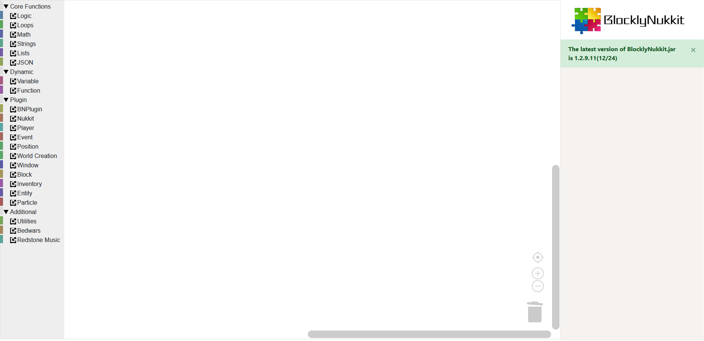

# BlocklyNukkit

#### Introduction
Our online website: [Click to enter](https://tools.blocklynukkit.com/)

Blocklynukkit friendly interface Chinese plug-in editor is an open-source plug-in editor project started by Surperice666. Its purpose is to provide fresh, powerful, practical and concise Chinese server plug-in development services for the majority of server owners. It makes it easy for more server owners who want to develop their own plug-ins but are deterred from the obscure Java programming Develop all kinds of functions you want.

Our code is completely open source based on AGPL3.0. Anyone can join us or contribute. If you are a user or a server owner, you can [enter the tutorial here](https://docs.qq.com/doc/DRkRpS0xmV2ZJbGdi) to learn how to use this project and build your own plug-in.

## BlocklyNukkit Interpreter

### Overview

[BlocklyNukkit Loader](https://gitee.com/Kingdom_of_dragon/BlocklyNukkit_Loader)
The BlocklyNukkit interpreter (ie BN_Loader) is a multi-language interpreter based on dynamic bytecode generation. Right now, it can use four languages: JavaScript, Python, Lua, PHP, and C/C++.

BN_Loader is the core library of this project. For technical security reasons, it is hosted on the Chinese code hosting platform gitee.

### Language Support

The following languages are supported:
|Language		|Standard		|
|-				|-				|
|JavaScript		|ECMA 5.1		|
|Python			|2.7			|
|Lua			|5.2			|
|PHP			|5.3			|
|C				|C11			|
|C++			|C++20			|
|wast			|WASI 2020/12/23|

### Download

You can directly use [BN official website link](https://tools.blocklynukkit.com/BlocklyNukkit.jar) to download, or you can go to bn's [Continuous Integration Build](https://gitee.com/qdez/BlocklyNukkit_Loader/gitee_go/15181) Download *Daily build version*, the daily build version will provide the latest api and bug fixes

## Welcome
Welcome to blocklynukkit!

BlocklyNukkit is a complete set of fast, simple and efficient plug-in development framework from entry to high-level. It solves the problem of newcomers or developers who want to develop plug-ins but have difficulty getting started or have no development skills, so that all server owners can quickly start the development of plug-ins and quickly learn the essence of plug-in development, without worrying about useless tedious details, and realize your own ideas!

## Target user
-Beginners of Nukkit plugin development with zero foundation
-Server owners who want to realize their ideas quickly
-Developers of Nukkit plugins without a computer or Java compilation environment
-Those who only know JavaScript, Python, Lua or PHP and want to develop plug-ins
-Very proficient server owner in JavaScript, Python, Lua or PHP
-Developers who want to use C/C++ for high-performance plug-in development
-Developers who want to master new skills

## How to develop
**BN and bn below refer to BlocklyNukkit**
### Use graphical editor to develop
One of the biggest features of BlocklyNukkit is that it provides a simple, fast and efficient graphical editor for people without any programming experience or foundation. Using the graphical editor, you can quickly drag and drop puzzles similar to scratch. A simple plug-in is implemented, and it can be directly packaged into a jar and released.

To use the BlocklyNukkit graphical editor, just open [https://tools.blocklynukkit.com](https://tools.blocklynukkit.com) in your browser

For English users, please open [https://tools.blocklynukkit.com?language=english](https://tools.blocklynukkit.com?language=french)
Please note that the English translation is contributed by the user and is not maintained by the development team.

For French users, please open [https://tools.blocklynukkit.com?language=french](https://tools.blocklynukkit.com?language=french)
Please note that the French translation is contributed by the user and is not maintained by the development team. If you also want to contribute your own language translation, please refer to [Translation Contribution Tutorial](https://www.kancloud.cn/superice666/bn_guide/1741091)

You can go to the BN tutorial library [http://www.blocklynukkit.info](http://www.blocklynukkit.info) to learn how to use
Or go to our qq group 953752196 to learn how to use
You can also join our server to communicate and learn through the discord link [https://discord.gg/94YWU9X](https://discord.gg/94YWU9X)
bn graphical editor display:

(The entire development team is just me, I really don’t have enough time)

## Contributing

See [Contributing.MD](CONTRIBUTING_EN.md)

For details on the compilation of multi-language translation and help tutorials, please refer to [http://www.blocklynukkit.info](http://www.blocklynukkit.info) in the development wiki chapter of the participating contribution tutorials. For project code contributions, please contact the development team or Super God The icy cold.

#  Sponsor Us

## Some officially released bn plugins:
- Music bucket: [mcbbs download](https://www.mcbbs.net/thread-1026281-1-1.html)
- Sky Island Technology: [mcbbs download](https://www.mcbbs.net/thread-1025826-1-1.html)
- OP check backpack: [mcbbs download](https://www.mcbbs.net/thread-1023528-1-1.html)
- Iron block elevator: [mcbbs download](https://www.mcbbs.net/thread-1022615-1-1.html)
- One-click tree cutting: [mcbbs download](https://www.mcbbs.net/thread-993246-1-1.html)
- One-click harvesting of crops: [mcbbs download](https://www.mcbbs.net/thread-997816-1-1.html)
- Redstone Music: [mcbbs download](https://www.mcbbs.net/thread-1015627-1-1.html)
- Death Transmission: [mcbbs download](https://www.mcbbs.net/thread-1013139-1-1.html)
- Void pull back: [mcbbs download](https://www.mcbbs.net/thread-1010990-1-1.html)
- Box sorting: [mcbbs download](https://www.mcbbs.net/thread-1000413-1-1.html)
- Automatic stone brushing machine: [mcbbs download](https://www.mcbbs.net/thread-995834-1-1.html)
- Kick menu: [minebbs download](https://www.minebbs.com/resources/ekick.1088/)
- Real-time cps display: [mcbbs download](https://www.mcbbs.net/thread-1027746-1-1.html)
- Magic stick: [mcbbs download](https://www.mcbbs.net/thread-1027698-1-1.html)
- gui song: [mcbbs download](https://www.mcbbs.net/thread-1028589-1-1.html)
- Pvp road-taking exercise: [minebbs download](https://www.minebbs.com/resources/coblocks-nk.1149/)
- Loan usury bank: [minebbs download](https://www.minebbs.com/resources/cobank.1165/)
- Parkour management system: [minebbs download](https://www.minebbs.com/resources/bn-corun.1172/)
- Advanced script block: [minebbs download](https://www.minebbs.com/resources/bn-scriptblock.1180/)
- Custom weapons: [minebbs download](https://www.minebbs.com/resources/bn-blocklynukkit.1179/)
- Parkour rewards: [minebbs download](https://www.minebbs.com/resources/bn-lxrun.1181/)
- X points: [minebbs download](https://www.minebbs.com/threads/bn-char_xjifen-x-bn.3891/)

## For bn plugin developers

## bn Developer Qia Fan Raiders

### 1. Take customized orders
In the major nukkit server groups, there are many server owners who will publish customized plug-in requirements. You can make money by taking orders. If you want to take orders, modify your group business card or private chat to publish customized requirements. Very good way.
Under normal circumstances, starting with a custom order of 50, it is a little harder to be 100+RMB, and you can at least earn the electricity bill for writing plug-ins every day.

### 2. Sell emeralds at mcbbs
The mcbbs forum has a developer reward mechanism. Regardless of whether your plug-in is used or not, as long as you make and publish it, you can apply for the virtual currency of emerald as a reward.
There are many emerald merchants in mcbbs who specialize in purchasing emeralds. The purchase here actually refers to purchasing for others. Basically, the price of emeralds is maintained at 40 RMB/piece, and each purchase will only purchase 12/17/24 pieces. , There will be 1-3 emeralds for every ordinary plug-in released, 8 if you make it carefully, and 15 or so if you continue to update it, which is equivalent to 600RMB, which is relatively stable and has a considerable income. Way.

### 3. Selling diamonds at minebbs
The developer reward mechanism of minebbs forum is diamonds. You can get diamonds by applying for the essence plug-ins, and the threshold is much lower than that of mcbbs. Almost all plug-ins can get diamonds. The good plug-ins can get 15 or so, and the general small plug-ins are 2 , 3 such.
Because minebbs has a transfer mechanism, it is more convenient to sell diamonds to merchants who collect diamonds. Each diamond is about 8RMB, and 1 can be sold. It is a good place for novices.

### 4. Participate in the blocklynukkit development competition
bn will regularly hold development competitions in minebbs. Winners will receive cash rewards ranging from tens of dollars and rich diamond rewards. If you participate in a competition and do it with your heart, it’s okay to make a few tens of dollars.

## How to make your plugin easier to get high emerald/diamond rewards

### 1. Typesetting your posts carefully
As we all know, it is very important to make a beautiful layout for your plug-in posts, especially mcbbs. The same plug-in can be up to 5-6 emeralds because of the post typesetting.
Go to Baidu to learn about BBCode, which is very useful. Remember, a good typography is very important!
### 2. Add some irrelevant functions
The more plug-in functions, the better, and in fact, it is very simple to extend the functions of your plug-in. Let me give you an example, such as the real-time cps plug-in. Obviously, it can only display too few cps functions. It is completely possible to add a player record with high cps, cps ranking, etc., which will make the plug-in a lot of color
### 3. Package your js plugin as a jar
mcbbs has a much higher affinity for jar than js, [one-click packaging](http://tools.blocklynukkit.com/jar.html)
### 4. Many pictures! Multi-map!
The importance is self-evident
### 5. Actively mining plug-in applicable scenarios
Write out the usage scenarios of your plug-in and put it in the post with pictures. As long as you count the above, the review will consider your plug-in to be very valuable
### 6. Appropriate "false publicity"
Write down some of the advantages that are not entirely your plug-in, such as high performance based on bn driver, extremely fast customization, high concurrency, fast configuration, etc.
### 7. Grasp the pain point
Think about how difficult it was to be without this plug-in when you opened the server, and play it up/funny

## Changelog

[View changes here](CHANGELOG_EN.md)