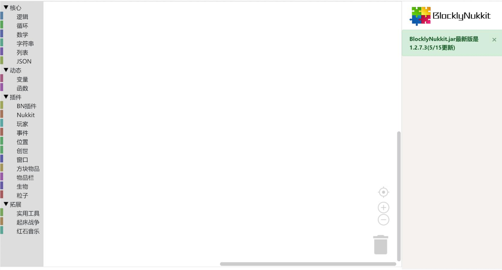

# BlocklyNukkit

#### 介绍
我们的在线使用网址：[点击进入](https://tools.blocklynukkit.com)  

blocklynukkit友好界面中文插件编辑器是由超神的冰凉发起的开源插件编辑器项目，其目的为致力于为广大服主提供清爽、强大、实用、简洁的中文服务器插件开发服务，使得更多想要开发自己的插件却对晦涩难懂的JAVA编程望而却步的服主能够很容易的，以拖拽的形式开发出自己想要的各种功能。  

我们的代码完全基于AGPL3.0开源，任何人都可以加入我们或者做出贡献，如果您是使用者或者服主，您可以在此[进入教程](https://docs.qq.com/doc/DRkRpS0xmV2ZJbGdi)学习如何使用本项目并构建自己的插件。

## 欢迎
欢迎来到blocklynukkit！
blocklynukkit是一套完整的从入门到高阶的快捷简单高效率插件开发框架，解决了各位希望开发插件但又苦于难以入门或没有开发条件的新人或开发者的问题，使得各位服主可以快速零基础上手开发插件并快速学习开发插件的精髓，不必在意没有用的繁琐细节，并实现自己的创想！

## 目标使用者
- 零基础入门nukkit插件开发的初学者
- 想快速实现自己的想法的服主
- 没有电脑或java编译环境的nukkit插件开发者
- 只会JavaScript或者python又想开发插件的人
- JavaScript或者python十分熟练的服主
- 希望掌握新技能的开发者

## 如何开发
**下文的BN、bn均指代BlocklyNukkit**
### 使用图形化编辑器开发
BlocklyNukkit最大的特点之一就是为没有任何编程经验或者基础的人提供了一个简单、快速、高效的图形化编辑器，使用图形化编辑器，您可以快速地通过类似于scratch的拖拽拼图的方式实现简单的插件，并且可以直接打包成jar发布。  

要使用BlocklyNukkit图形化编辑器，只需在浏览器打开[https://tools.blocklynukkit.com](https://tools.blocklynukkit.com)   

对于法语用户，请打开[https://tools.blocklynukkit.com?language=french](https://tools.blocklynukkit.com?language=french)
请注意，法语翻译由用户自行贡献，非开发团队维护。如果您也希望贡献自己语言的翻译，请参考[翻译贡献教程](https://www.kancloud.cn/superice666/bn_guide/1741091)  

对于英语用户，开发团队正在竭力进行英文翻译，请您耐心等待，我们将在7月10日左右添加英文翻译

您可以到BN教程库[http://www.blocklynukkit.info](http://www.blocklynukkit.info)学习如何使用
或者到我们的qq群953752196中学习如何使用
也可以通过discord链接[https://discord.gg/94YWU9X](https://discord.gg/94YWU9X)加入我们的服务器来沟通、学习
bn图形化编辑器展示：

### 使用JavaScript开发
BlocklyNukkit提供了一套成熟的JavaScript开发插件的解决方案，您可以使用JavaScript来开发插件。我们编写了JavaScript开发文档和配套的vscode插件来方便开发，开发完的代码可以直接打包成jar包发布，详细资料详见[http://www.blocklynukkit.info](http://www.blocklynukkit.info)

### 使用python开发
BlocklyNukkit在最新版本中提供了python开发的能力，支持全部标准原生python库和全部的java类库直接导入，而且您还可以直接import其他插件的类、函数与对象进行操作。详细资料详见[http://www.blocklynukkit.info](http://www.blocklynukkit.info)
注：python开发文档尚未完成，我们将尽快提供，感谢您的支持与理解

(整个开发团队就3个人，其中两个是学生，我们真的时间不够用)

## 做出贡献

您可以在一下三方面做出贡献
1. 图形化编辑器多语言翻译
2. 帮助blocklynukkit.info网站的教程编写
3. 贡献项目代码

多语言翻译与帮助教程编写详见[http://www.blocklynukkit.info](http://www.blocklynukkit.info)的开发wiki章节的参与贡献教程，贡献项目代码请联系开发组或超神的冰凉。

## 赞助我们

## 一些正式发布的bn插件：
- 乐色桶：[mcbbs下载](https://www.mcbbs.net/thread-1026281-1-1.html)
- 空岛科技：[mcbbs下载](https://www.mcbbs.net/thread-1025826-1-1.html)
- OP查背包：[mcbbs下载](https://www.mcbbs.net/thread-1023528-1-1.html)
- 铁块电梯：[mcbbs下载](https://www.mcbbs.net/thread-1022615-1-1.html)
- 一键砍树：[mcbbs下载](https://www.mcbbs.net/thread-993246-1-1.html)
- 一键收割作物：[mcbbs下载](https://www.mcbbs.net/thread-997816-1-1.html)
- 红石音乐：[mcbbs下载](https://www.mcbbs.net/thread-1015627-1-1.html)
- 死亡传送：[mcbbs下载](https://www.mcbbs.net/thread-1013139-1-1.html)
- 虚空拉回：[mcbbs下载](https://www.mcbbs.net/thread-1010990-1-1.html)
- 箱子整理：[mcbbs下载](https://www.mcbbs.net/thread-1000413-1-1.html)
- 自动刷石机：[mcbbs下载](https://www.mcbbs.net/thread-995834-1-1.html)
- kick踢人菜单：[minebbs下载](https://www.minebbs.com/resources/ekick.1088/)
- 实时cps显示：[mcbbs下载](https://www.mcbbs.net/thread-1027746-1-1.html)
- 神奇的棍子：[mcbbs下载](https://www.mcbbs.net/thread-1027698-1-1.html)
- gui点歌：[mcbbs下载](https://www.mcbbs.net/thread-1028589-1-1.html)
- pvp搭路练习：[minebbs下载](https://www.minebbs.com/resources/coblocks-nk.1149/)
- 高利贷银行：[minebbs下载](https://www.minebbs.com/resources/cobank.1165/)
- 跑酷管理系统：[minebbs下载](https://www.minebbs.com/resources/bn-corun.1172/)
- 高级脚本方块：[minebbs下载](https://www.minebbs.com/resources/bn-scriptblock.1180/)
- 自定义武器：[minebbs下载](https://www.minebbs.com/resources/bn-blocklynukkit.1179/)
- 跑酷奖励：[minebbs下载](https://www.minebbs.com/resources/bn-lxrun.1181/)
- X积分：[minebbs下载](https://www.minebbs.com/threads/bn-char_xjifen-x-bn.3891/)
  
  
## 给bn插件开发者  

## bn开发者恰饭攻略  

### 1.接定制单
在各大nukkit服主群内有很多的服主会发布定制插件需求，你可以接单来赚钱，如果你想要接单的话，修改自己的群名片或者私聊发布定制需求的服主都是很好的方式。  
一般情况下，接一个定制单50起步，稍微难一点100+RMB，你可以至少赚到每天写插件花的电费。  

### 2.在mcbbs卖绿宝石
mcbbs论坛有一个开发者奖励机制，不管你的插件有没有人用，只要你做出来并且发布，就可以申领绿宝石这种虚拟货币作为奖励。  
mcbbs有很多绿宝石商人专门收购绿宝石，这里的收购其实是指帮别人代购，基本上绿宝石的价格维持在40rmb/颗这样，每次收购只会收购12颗/17颗/24颗这样的，每发布一个普通插件会有1-3颗绿宝石，用心做的话会有8颗左右，如果还持续更新的话会有15颗左右，相当于600RMB，是比较稳定而且收入还比较可观的恰饭方式。  

### 3.在minebbs卖钻石
minebbs论坛的开发者奖励机制是钻石，申请精华插件可以获得钻石，而且门槛比mcbbs低了不少，几乎所有插件都能获得钻石，用心的好插件可以获得15个左右，一般的小插件在2、3个这样。  
minebbs由于有转账机制，所以出售钻石给收钻石的商人更便捷，每个钻石大概在8RMB左右，1个就能卖，是新手恰饭的好去处  

### 4.参与blocklynukkit开发赛
bn会定期在minebbs举办开发比赛，优胜者将获得数十元不等的现金奖励和丰富的钻石奖励，参加一次比赛用心做的话恰个几十块钱没问题  

## 如何让你的插件更加容易获得高绿宝石/钻石奖励  

### 1.用心给你的帖子排版
众所周知，给你的插件帖子做一个美观的排版十分重要，尤其是mcbbs，同样的插件因为帖子排版最多能差出5-6个绿宝石  
上百度稍微学习一下BBCode，十分有用。记住，一个好的排版十分重要！ 
### 2.加一些无关痛痒的功能
插件功能越多越好，而且实际上给你的插件拓展功能很简单，我举个例子，比如实时cps插件，显然只能显示cps功能太少了。完全可以添加一个cps过高玩家记录，cps排行榜等等，会让插件出彩很多  
### 3.把你的js插件打包为jar
mcbbs对jar的好感度远高于js，[一键打包](http://tools.blocklynukkit.com/jar.html)
### 4.多图！多图！
重要性不言而喻
### 5.主动挖掘插件适用场景
将你的插件的使用场景都写出来放在帖子并最好配图，只要扯上边都算上，审核就会认为你这个插件很有价值
### 6.适当的"虚假宣传"
把一些并不完全属于你插件的优点写上，比如基于bn驱动高性能，极速自定义，高并发，快速配置等等
### 7.抓住痛点
想想你开服的时候被没有这个插件难受到了什么地步，大肆渲染一下/滑稽

## 更新日志 
## 1.2.8.3

Bugs Fixed

- 修复了bnnpc浮空走路bug
- 修复了浮空物品空事件报错
- 现在的报错信息比以前好看多了

manager

- <E> callFunction(String functionname,Object... args) --callFunction会返回函数的返回值了
- <E> getVariableFrom(String scriptName,String varName) --根据bn插件名和变量名获取变量内容
- void putVariableTo(String scriptName,String varName,<E> var) --把变量值以指定变量名放到指定bn插件中
- double getCPULoad()
- int getCPUCores()
- double getMemoryTotalSizeMB()
- double getMemoryUsedSizeMB()
- void forceDisconnect(Player player)
- Array<String> getEventFunctions(Event event)
- void getServerMotd(String host, int port, String callback) --根据服务器IP和端口获取在线人数信息

blockitem

- void setItemColor(Item item,int r,int g,int b)
- void setItemUnbreakable(Item item,boolean unbreakable)

inventory

- Item getEntityHelmet(Entity entity)
- Item getEntityChestplate(Entity entity)
- Item getEntityLeggings(Entity entity)
- Item getEntityBoots(Entity entity)
- Item getEntityItemInHand(Entity entity)
- Item getEntityItemInOffHand(Entity entity)
- void setEntityItemHelmet(Entity entity,Item item)
- void setEntityItemChestplate(Entity entity,Item item)
- void setEntityItemLeggings(Entity entity,Item item)
- void setEntityItemBoots(Entity entity,Item item)
- void setEntityItemInHand(Entity entity,Item item)
- void setEntityItemInOffHand(Entity entity,Item item)
- Item getInventorySlot(Inventory inv,int slot)

window

- void forceClearWindow(Player player)
- int getEventResponseIndex(PlayerFormRespondedEvent event)

entity

- boolean isPlayer(Entity e)
- void spawnFallingBlock(Position pos, Block block, boolean enableGravity,boolean canBePlaced)

gameapi --新的基对象

- void createGame(String name,boolean useTeam,String startGameCallBack,String endGameCallBack,String mainLoopCallBack,String deathCallBack)
    -- 创建一个小游戏房间
- void joinGame(Player player, String gameName) --让玩家进入指定名称的小游戏，自动匹配房间
- void leaveGame(Player player) --让玩家从小游戏房间离开
- boolean isPlayerInGame(Player player) --玩家是否正在玩某个小游戏
- GameBase getPlayerRoom(Player player) --获取玩家正在玩的小游戏对象
- Array<GameBase> getAllRoomByName(String gameName) --获取游戏名称相同的所有小游戏房间对象组成的数组
- Array<String> getAllGameNames() --获取所有正在运行的小游戏房间的名字组成的数组
- Messager getMessager(String prefix)
- Messager getGameMessager(GameBase game)
- Multiline getMultiline(String messageType)
- InventoryMenu createInventoryMenu(String inventoryType, String title)
- FormMenu createFormMenu(String title, String content)
- void addMenuItem(InventoryMenu menu, int slot, Item item, String inventoryCallback)
- void addMenuButton(FormMenu menu,String buttonText,String imageData,String formCallback)
- Scoreboard getScoreboard(Player p)
- void setObjective(Scoreboard sb, String objectiveName,String displayName)

GameBase --小游戏房间对象

EventLoader --73 new

- BlockFadeEvent
- BlockFallEvent
- BlockFromToEvent
- BlockGrowEvent
- BlockIgniteEvent
- BlockPistonChangeEvent
- BlockRedstoneEvent
- DoorToggleEvent
- CreatureSpawnEvent
- CreeperPowerEvent
- EntityArmorChangeEvent
- EntityBlockChangeEvent
- EntityCombustByBlockEvent
- EntityCombustByEntityEvent
- EntityCombustEvent
- EntityDamageByBlockEvent
- EntityDamageByChildEntityEvent
- EntityExplodeEvent
- EntityMotionEvent
- EntityPortalEnterEvent
- EntityRegainHealthEvent
- EntityShootBowEvent
- EntityVehicleEnterEvent
- EntityVehicleExitEvent
- ExplosionPrimeEvent
- BrewEvent
- EnchantItemEvent
- InventoryMoveItemEvent
- StartBrewEvent
- ChunkLoadEvent
- ChunkPopulateEvent
- LevelInitEvent
- LevelLoadEvent
- LevelSaveEvent
- LevelUnloadEvent
- SpawnChangeEvent
- ThunderChangeEvent
- WeatherChangeEvent
- PlayerAchievementAwardedEvent
- PlayerAnimationEvent
- PlayerAsyncPreLoginEvent
- PlayerBlockPickEvent
- PlayerBucketEmptyEvent
- PlayerBucketFillEvent
- PlayerChangeSkinEvent
- PlayerChunkRequestEvent
- PlayerCreationEvent
- PlayerDropItemEvent
- PlayerEatFoodEvent
- PlayerEditBookEvent
- PlayerFoodLevelChangeEvent
- PlayerGameModeChangeEvent
- PlayerGlassBottleFillEvent
- PlayerInvalidMoveEvent
- PlayerItemConsumeEvent
- PlayerLocallyInitializedEvent
- PlayerMapInfoRequestEvent
- PlayerMouseOverEntityEvent
- PlayerServerSettingsRequestEvent
- PlayerSettingsRespondedEvent
- PluginDisableEvent
- PluginEnableEvent
- PotionApplyEvent
- PotionCollideEvent
- PlayerDataSerializeEvent
- RemoteServerCommandEvent
- EntityEnterVehicleEvent
- EntityExitVehicleEvent
- VehicleCreateEvent
- VehicleDamageEvent
- VehicleDestroyEvent
- VehicleMoveEvent
- VehicleUpdateEvent
- LightningStrikeEvent

### 1.2.8.2

Bug Fixed

- 修复了bnnpc和bn浮空字莫名其妙消失的问题

New

- 现在可以在js代码的开头加上一行注释//pragma es9来开启es9语言特性，但是会有些许性能损失，损失不大，可以放心使用
- 此功能仍然是试验功能，如果报错，请立即反馈，感谢
- bninstall命令已经弃用，所有库全部打包进bn解释器jar，这样做是为了节约内存空间。

CustomWindowBuilder

- Custom showAsSetting(Player p, String callback)
- Custom buildDropdown(String title,String inner,int index)

EventLoader

- ChunkUnloadEvent

entity

- void setPlayerExp(Player player,int exp)
- int getPlayerExp(Player player)
- void setPlayerExpLevel(Player player,int lel)
- int getPlayerExpLevel(Player player)
- void setPlayerHunger(Player player,int hunger)
- int getPlayerHunger(Player player)

window

- void makeTipsVar(String varname,String providerCallback)
- void makeTipsStatic(String varname,String toReplace)

### 1.2.8.1

Entity

- BNNPC buildNPC(Position pos,String name,String skinID,int calltick,String callfunction,String attackfunction)
- void showFloatingItem(Position pos,Item item)
- void removeFloatingItem(Position pos,Item item)

windowbuilder

- Custom buildSlider(String title,double min,double max)
- Custom buildSlider(String title,double min,double max,int step)
- Custom buildSlider(String title,double min,double max,int step,double defaultvalue)
- Custom buildStepSlider(String title,String options)
- Custom buildStepSlider(String title,String options,int index)

window

- String getEventCustomVar(PlayerFormRespondedEvent event,int id,String mode)
- mode可以为input toggle dropdown slider stepslider

BNNPC

- void displaySwing()
- void setSwim(boolean swim)
- void setSwim()
- void setTickCallback(String callback)
- void setAttackCallback(String callback)

manager

- void bStats(String pluginName,String pluginVer,String authorName,int pluginid)
- void callFunction(String functionname,Object... args) --修复了错误的拼写

world

- void loadScreenTP(Player player,Position pos)
- void loadScreenTP(Player player,Position pos,int loadScreenTick)
- void clearChunk(Position pos)

EventLoader

- PlayerHeldEvent
- InventoryClickEvent

Bug Fixed

- manager.kickPlayer不再会显示"kicked by admin"前缀了
- bnnpc打人会正确地摇动手臂了
- callFunction拼写是正确的了
- database现在真的可用了，所有库都会被正确安装

### 1.2.8.0_LTS
类库管理器

- 现在类库管理器可以直接安装模块了，暂时只有python和database两个模块
- 使用命令 bninstall 模块名 安装这个类库

window

- void setBelowName(Player player,String str)

manager

- void loadJar(String path)

world

- void setOceanGenerator(int seaLevel)

entity

- BNNPC buildNPC(Position pos,String name,String skinID)
- BNNPC buildNPC(Position pos,String name,String skinID,int calltick,String callfunction)

BNNPC

- void turnRound(double yaw)
- void headUp(double pitch)
- void setEnableAttack(boolean attack)
- void setEnableAttack()
- void setEnableHurt(boolean hurt)
- void setEnableHurt()
- void displayHurt()
- void start()
- void setEnableGravity(boolean gravity)
- void setEnableGravity()
- void setG(double newg)
- void lookAt(Position pos)
- Player getNearestPlayer()
- boolean isSneak()
- void setSneak(boolean sneak)
- void setSneak()
- void jump()
- void setJumpHigh(double j)
- void setEnableKnockBack(boolean knock)
- void setEnableKnockBack()
- void setKnockBase(double base)
- boolean canMoveTo(Position to)
- boolean findAndMove(Position to)
- void setSpeed(double s)
- void setRouteMax(int m)
- void stopMove()
- void hit(Entity entity)

bug fixed:

- entity的effect有些药水不显示问题，但是仍然有些药水效果因为nk不支持无法显示
- world生成VOID和OCEAN出错问题
- 天域世界配置丢失问题
- ssh报错问题
- 现在窗口管理器的操作函数都返回自身，可以直接在代码里连缀了

### 1.2.7.4

Languages

现在可以使用python2.7来制作插件了
添加了对python开发插件的完全支持，只需要下载额外的py支持包即可使用python插件
对于python开发插件的支持将与JavaScript保持同步，python与js使用同一套bn类库，所有js的bn类库(除了Java模块)之外都可以在python中直接调用，无需import
支持全部的python2.7原生标准语法和标准库，运行时与js相同，编译为java字节码运行，不必担心效率低下问题
pythonForBN支持模块下载：https://tools.blocklynukkit.com/pythonForBN.jar
下载后直接放到./plugins/BlocklyNukkit文件夹下面即可

EventLoader

- PlayerInteractEntityEvent
- PlayerDamageByPlayerEvent
- PlayerDamageByEntityEvent
- EntityKilledByEntityEvent
- EntityKilledByPlayerEvent
- PlayerRespawnEvent

window

- void setPlayerBossBar(Player player,String text,float len)
- void removePlayerBossBar(Player player)
- double getLengthOfPlayerBossBar(Player player)
- String getTextOfPlayerBossBar(Player player)

manager

- void createPermission(String per,String description,String defaultper)
- void removePermission(String per)
- boolean checkPlayerPermission(String per,Player player)
- String MD5Encryption(String str)
- String SHA1Encryption(String str)
- void createCommand(String name, String description, String callbackFunctionName, String per)
- void newCommand(String name, String description, Function jsFunction,String per)

entity

- int getNetworkID(Entity entity)
- String getIDName(Entity entity)
- void spawnEntity(String name,Position pos)

notemusic

- HornSongPlayer buildHorn(Song song, Position pos, boolean isloop, boolean isautodestroy)
- void addPlayerToHorn(HornSongPlayer SongPlayer, Player player)
- void removePlayerToHorn(HornSongPlayer SongPlayer, Player player)
- Array getPlayerInHorn(HornSongPlayer radioSongPlayer)
- void setHornStatus(HornSongPlayer radioSongPlayer, boolean isplaying)
- Song getSongInHorn(HornSongPlayer radioSongPlayer)

world

- genLevel新增"OCEAN"海洋世界生成器

bug fixed

- setNameTagAlwaysVisable error

### 1.2.7.3  

blockitem  

- 修复了nbt函数的错误

EventLoader  

- 修复了玩家判断错误的bug

entity  

- 更换浮空字的pid为盔甲架的pid

Loader  

- 现在bn插件控制台输出会使用文件名作为前缀而不是\[BlocklyNukkit\]
- 非op不再可见bn命令

编辑器  

- 添加JSON模块
- 添加jar在线编译器

### 1.2.7.2  

manager

- String formatJSON(String json)
- 修复writeFile函数无法自动创建路径的错误

### 1.2.7.1  

修复部分老版本nk/pn内核无法加载的错误  

### 1.2.7.0  

manager

- String readFile(String path)
- void wirteFile(String path,String text)
- boolean isFileSame(String path1,String path2)
- String JSONtoYAML(String json)
- String YAMLtoJSON(String yaml)
- void newCommand(String name, String description, Function fun)
- int setTimeout(Function fun,int delay,<E+>... args)
- void clearTimeout(int id)
- int setInterval(Function fun,int delay,<E+>... args)
- void clearInterval(int id)
- void isWindows()
- int getPlayerGameMode(Player player)

Loader

- \_\_NAME\_\_ 表示加载的js文件的名称(可防御低级改名倒卖)
- 新版发布后，24小时强制更新

Custom/Modal/Simple (WindowBuilder)

- void showToPlayerCallLambda(Player p, Function fun)

blockitem

- Array<Enchantment> getItemEnchant(Item item)
- int getEnchantID(Enchantment enchantment)
- int getEnahcntLevel(Enchantment enchantment)

EventLoader

- PlayerJumpEvent
- PlayerToggleFlightEvent
- PlayerToggleGlideEvent
- PlayerToggleSwimEvent
- PlayerToggleSneakEvent
- PlayerToggleSprintEvent

